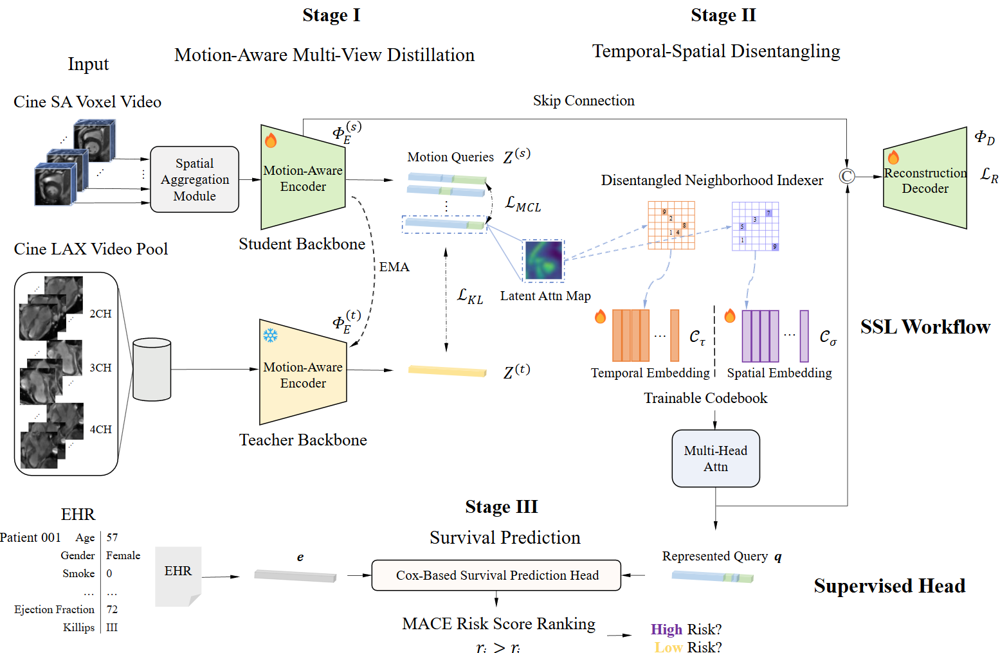
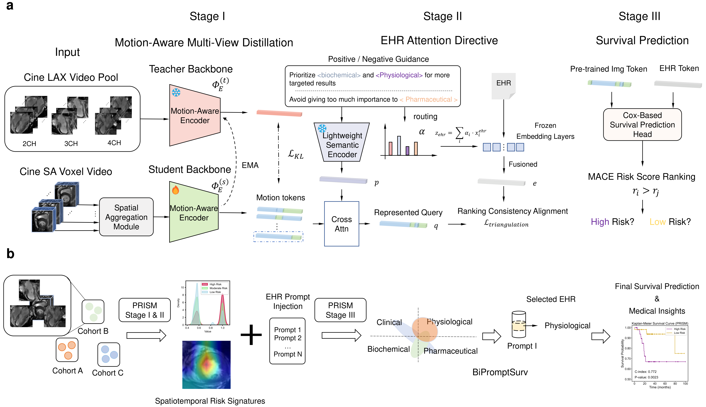

# Our Work
- **CTSL**: Codebook-Based Temporal-Spatial Learning for Accurate Non-contrast Cardiac Risk Prediction Using Cine MRIs
- **PRISM**: Prompt-guided Representation Integration for Survival Modeling  

## What's new
[2025-09] We propose **PRISM**, which inherits the multi-view distillation framework of CTSL from **Stage I** and incorporates medical text as prompts in **Stage II** to form a multimodal aggregation.  
[2025-07] We have publicly released the SSL scripts of the CTSL framework for **Stage I** and **Stage II** and the survival prediction scripts for **Stage III**.


## Table of Contents

1. [Introduction](#introduction)  
2. [Highlights](#highlights)  
3. [Installation](#installation)  
4. [Datasets and Usage](#datasets-and-usage)  
5. [Model Architecture](#model-architecture)  
6. [Training](#training)  
7. [Evaluation](#evaluation)  

---

## Introduction

- CTSL and PRISM are self-supervised frameworks for predicting major adverse cardiac events (MACE) by integrating cardiac MRI and clinical data.  
-> **CTSL** leverages **multi-view motion distillation** and **discretized codebooks design** to capture dynamic and distinct cardiac features.  
-> **PRISM** builds upon CTSL's Stage I multi-view distillation framework and further incorporates **medical text as subjective prompts** in Stage II to achieve **multimodal aggregation**.

## Highlights

- 📍Self-supervised framework  
- 📍Multi-view motion-aware feature distillation
- 📍Reconstruction-constrained codebook design to decouple temporal and spatial discrete features
- 📍Prompt-guided modulation using medical knowledge  
- 📍Supports survival analysis with fine-grained risk prediction  
- 📍Validated on multiple clinical cohorts  

## Installation

```bash
git clone https://github.com/Hoyant-Su/PRISM.git
conda create --name PRISM python=3.10
conda activate PRISM
cd PRISM
pip install -r requirements.txt
```

## Datasets and Usage

###  Image Pre-processing: 🫀 Myocardial Localization
We utilize the optical flow algorithm from OpenCV (`cv2`) to extract the position of the myocardium. The script `preprocess/optical_flow_crop.py` provides a function to perform this localization within 4D Nifti data.

### Metadata Preparation: 📝 JSON File Structure
Before running the training script, a JSON file that catalogs the dataset must be prepared. The JSON file should be structured as a list, where each element is a dictionary representing a unique patient case.

The key of each dictionary entry should be the patient or case ID. Paths to all associated image files under the `"img"` key and other required metadata can be organized below.

**Example of `survival_analysis.json`:**

```json
[
  {
    "1703061492": {
      "img": [
        "/path/to/your/data/sample_0/CINE-SA/0.nii.gz",
        "/path/to/your/data/sample_0/CINE-2CH/0.nii.gz"
        "/path/to/your/data/sample_0CINE-3CH/0.nii.gz"
        "/path/to/your/data/sample_0CINE-4CH/0.nii.gz"
      ],
      "performance": "wo",
      "diagnosis": "wo",
      "survival_time": 93.73333333333336,
      "c": "1",
      "center": "cohortA"
    }
  },
  {
    "1707100347": {
      "img": [
        "/path/to/your/data/sample_1/CINE-SA/0.nii.gz",
        "/path/to/your/data/sample_1/CINE-2CH/0.nii.gz"
        "/path/to/your/data/sample_1/CINE-3CH/0.nii.gz"
        "/path/to/your/data/sample_1/CINE-4CH/0.nii.gz"
      ],
      "performance": "wo",
      "diagnosis": "wo",
      "survival_time": 89.66666666666669,
      "c": "1",
      "center": "cohortB"
    }
  }
]
```

## Model Architecture

The CTSL framework and PRISM framework are trained in distinct stages:

-   **Stage I: ⚙️ Motion-Aware Multi-View Distillation**
    -   Knowledge distillation using multi-view CMR data (SAX & LAX at 2/3/4CH).

-   **Stage II (CTSL): ⚙️ Disentangled codebooks**
    -   A discretization technique to amplify the differences between samples with varying risk levels.

-   **Stage II (PRISM): ⚙️ EHR-Attention Guidance**
    -   An attention mechanism guided by Electronic Health Records (EHR).

-   **Stage III: ⚙️ Survival Prediction**
    -   Fine-tuning for survival analysis using a Cox Proportional-Hazards (CoxPH) model.

<table>
<tr>
<td></td>
<td></td>
</tr>
</table>

## Training

The model is trained in a three-stage process. This includes unsupervised learning for stages I & II (code available in `PRISM/ssl_pretraining`) and survival analysis fine-tuning for stage III (code available in `PRISM/finetune_survival`).

Basic configurations should be prepared with .yaml files before training in `configs` folder.


To start the training process, run the following script:

```bash
bash launch_train.sh
```

## Evaluation

After the training process is complete, the following outputs are generated:

-   **Model Checkpoints**: The checkpoints from the SSL pre-training are automatically stored in `ssl_pretraining/weights`.
-   **Survival Analysis Results**: All evaluation results and logs for the survival analysis are saved to `finetune_survival/logs`.`

## Citation
```
@InProceedings{10.1007/978-3-032-05182-0_15,
author="Su, Haoyang
and Rui, Shaohao
and Xiang, Jinyi
and Wu, Lianming
and Wang, Xiaosong",
editor="Gee, James C.
and Alexander, Daniel C.
and Hong, Jaesung
and Iglesias, Juan Eugenio
and Sudre, Carole H.
and Venkataraman, Archana
and Golland, Polina
and Kim, Jong Hyo
and Park, Jinah",
title="CTSL: Codebook-Based Temporal-Spatial Learning for Accurate Non-contrast Cardiac Risk Prediction Using Cine MRIs",
booktitle="Medical Image Computing and Computer Assisted Intervention -- MICCAI 2025",
year="2026",
publisher="Springer Nature Switzerland",
address="Cham",
pages="147--157",
abstract="Accurate and contrast-free Major Adverse Cardiac Events (MACE) prediction from cine MRI sequences remains a critical challenge. Existing methods typically necessitate supervised learning based on human-refined masks in the ventricular myocardium, which become impractical without contrast agents. We introduce a self-supervised framework, namely Codebook-based Temporal-Spatial Learning (CTSL), that learns dynamic, spatiotemporal representations from raw cine data without requiring segmentation masks. CTSL decouples temporal and spatial features through a multi-view distillation strategy, where the teacher model processes multiple cine views, and the student model learns from reduced-dimensional cine-SA sequences. By leveraging codebook-based feature representations and dynamic lesion self-detection through motion cues, CTSL captures intricate temporal dependencies and motion patterns. High-confidence MACE risk predictions are achieved through our model, providing a rapid, non-invasive solution for cardiac risk assessment that outperforms traditional contrast-dependent methods, thereby enabling timely and accessible heart disease diagnosis in clinical settings.",
isbn="978-3-032-05182-0"
}
```
```
@misc{su2025prismframeworkharnessingunsupervised,
      title={PRISM: A Framework Harnessing Unsupervised Visual Representations and Textual Prompts for Explainable MACE Survival Prediction from Cardiac Cine MRI}, 
      author={Haoyang Su and Jin-Yi Xiang and Shaohao Rui and Yifan Gao and Xingyu Chen and Tingxuan Yin and Xiaosong Wang and Lian-Ming Wu},
      year={2025},
      eprint={2508.19325},
      archivePrefix={arXiv},
      primaryClass={cs.CV},
      url={https://arxiv.org/abs/2508.19325}, 
}
```
